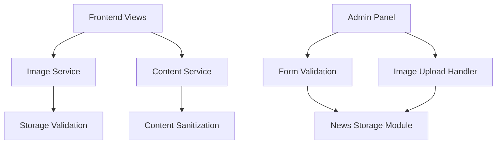

# Design Document

## Overview

Este documento describe el diseño técnico para solucionar los problemas críticos de imágenes, contenido y errores en el sistema UHTV. La solución se enfoca en corregir variables no definidas, mejorar el manejo de imágenes, limpiar el contenido de noticias y optimizar la compatibilidad CSS.

## Architecture

### Component Overview



### Key Components

1. **Image Service Enhancement**: Mejora del servicio existente para manejo robusto de imágenes
2. **Content Sanitization Service**: Nuevo servicio para limpiar y procesar contenido
3. **View Data Consistency**: Asegurar que todas las vistas reciban las variables necesarias
4. **Admin Form Validation**: Mejorar validación en formularios de administración
5. **CSS Optimization**: Optimizar CSS para compatibilidad entre navegadores

## Components and Interfaces

### 1. Enhanced NewsService

**Responsibilities:**
- Generar URLs de imágenes de forma consistente
- Validar existencia de archivos de imagen
- Proporcionar datos completos a todas las vistas

**Key Methods:**
```php
public function getSecureImageUrl($imagePath): string
public function getHomePageDataWithImages(): array
public function getNewsDetailDataComplete($newsId): array
```

### 2. ContentSanitizationService (New)

**Responsibilities:**
- Limpiar contenido HTML de caracteres extraños
- Procesar contenido del rich text editor
- Mantener formato mientras elimina elementos problemáticos

**Key Methods:**
```php
public function sanitizeContent(string $content): string
public function processRichTextContent(string $content): string
public function removeUnwantedCharacters(string $content): string
```

### 3. ImageValidationService (New)

**Responsibilities:**
- Validar rutas de imágenes
- Verificar existencia de archivos
- Generar URLs de fallback

**Key Methods:**
```php
public function validateImagePath(string $path): bool
public function getImageUrlOrDefault(string $path): string
public function generateThumbnailUrl(string $path): string
```

### 4. Enhanced Admin Controllers

**Improvements:**
- Mejor validación de formularios
- Manejo robusto de uploads de imágenes
- Mensajes de error más claros
- Validación de contenido antes de guardar

## Data Models

### Image Handling Strategy

```php
// Estructura de datos para imágenes
[
    'original_path' => 'noticias/imagen.jpg',
    'full_url' => 'https://domain.com/storage/noticias/imagen.jpg',
    'exists' => true,
    'fallback_url' => 'https://domain.com/images/default-news.svg'
]
```

### Content Processing Pipeline

```php
// Pipeline de procesamiento de contenido
Raw Content → HTML Entity Decode → Remove Unwanted Chars → Sanitize HTML → Final Content
```

## Error Handling

### Image Loading Errors

1. **Missing Image Files**: Usar imagen por defecto automáticamente
2. **Invalid Paths**: Registrar error y mostrar placeholder
3. **Permission Issues**: Verificar permisos de storage y mostrar mensaje apropiado

### Content Processing Errors

1. **Invalid HTML**: Sanitizar y limpiar automáticamente
2. **Encoding Issues**: Detectar y corregir encoding de caracteres
3. **Rich Text Errors**: Procesar contenido con fallback a texto plano

### Admin Panel Errors

1. **Upload Failures**: Mostrar mensajes específicos de error
2. **Validation Errors**: Destacar campos problemáticos
3. **Save Errors**: Preservar datos del formulario y mostrar error

## Testing Strategy

### Unit Tests

1. **ImageValidationService Tests**
   - Validación de rutas válidas e inválidas
   - Generación de URLs de fallback
   - Verificación de existencia de archivos

2. **ContentSanitizationService Tests**
   - Limpieza de caracteres extraños
   - Procesamiento de HTML válido e inválido
   - Preservación de formato importante

3. **NewsService Tests**
   - Generación correcta de datos para vistas
   - Manejo de casos edge (imágenes faltantes, contenido vacío)
   - Consistencia de datos entre diferentes vistas

### Integration Tests

1. **View Rendering Tests**
   - Verificar que todas las variables estén disponibles
   - Comprobar renderizado correcto de imágenes
   - Validar contenido limpio en vistas

2. **Admin Panel Tests**
   - Flujo completo de creación de noticias
   - Flujo completo de edición de noticias
   - Upload y manejo de imágenes

### Browser Compatibility Tests

1. **CSS Compatibility**
   - Verificar renderizado en Firefox, Chrome, Safari
   - Comprobar que no hay errores de consola
   - Validar fallbacks de CSS

## Implementation Phases

### Phase 1: Core Fixes
- Corregir variables no definidas en vistas
- Implementar ImageValidationService
- Crear ContentSanitizationService básico

### Phase 2: Enhanced Services
- Mejorar NewsService con manejo robusto de imágenes
- Implementar procesamiento completo de contenido
- Actualizar controladores de admin

### Phase 3: Optimization
- Optimizar CSS para compatibilidad
- Implementar caching de validación de imágenes
- Mejorar performance de procesamiento de contenido

### Phase 4: Testing & Validation
- Implementar tests unitarios e integración
- Validar compatibilidad entre navegadores
- Verificar funcionamiento en producción

## Security Considerations

1. **Image Upload Security**
   - Validar tipos de archivo permitidos
   - Verificar tamaño máximo de archivos
   - Sanitizar nombres de archivos

2. **Content Security**
   - Sanitizar HTML para prevenir XSS
   - Validar contenido antes de almacenar
   - Escapar output en vistas cuando sea necesario

3. **Path Traversal Prevention**
   - Validar rutas de imágenes
   - Prevenir acceso a archivos fuera del directorio permitido
   - Usar rutas absolutas cuando sea posible